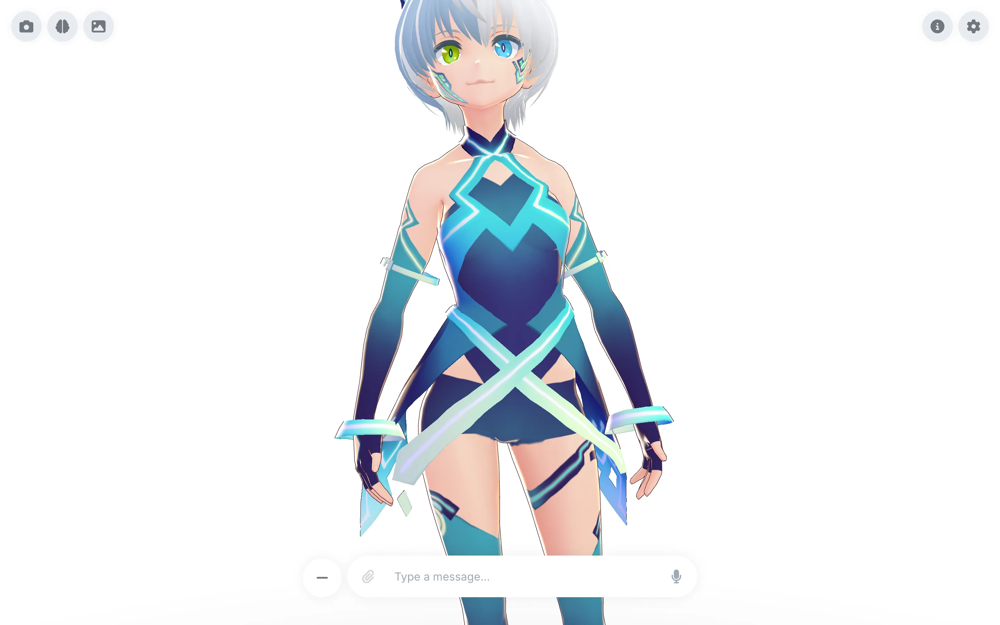

> [!WARNING]
> Luna y Whizzend no han acuñado, lanzado, respaldado ni autorizado ninguna criptomoneda, token, moneda, NFT o proyecto de blockchain. Nunca lo haremos. Si ves cripto asociada con Luna, es una estafa.

<p align="center">
  
</p>

<p align="center">
  <a href="https://luna.ai">Sitio web</a>
  ·
  <a href="https://app.luna.ai">Pruébala en tu navegador</a>
  ·
  <a href="https://docs.luna.ai">Documentación</a>
  ·
  <a href="https://luna.ai/blog">Blog</a>
</p>

<p align="center">
  <a href="https://nodejs.org/"></a>
  <a href="https://luna.ai/download"></a>
</p>

<p align="center">
  <a href="https://luna.ai/download">
    
  </a>
  <a href="https://luna.ai/download">
    
  </a>
  <a href="https://luna.ai/download">
    
  </a>
</p>

<p align="center">
  <sub>Las versiones beta están sin firmar, así que tu SO te advertirá al abrirla por primera vez (<a href="#descargar-la-app-de-escritorio">notas de instalación</a>). ¿Prefieres cero instalación? <a href="https://app.luna.ai">Ejecútala en tu navegador</a>.</sub>
</p>

---

**Luna es la compañera de IA de Whizzend, con avatares VRM 3D.** Una plataforma donde puedes tener una compañera virtual que aprende y crece contigo, con mecánicas opcionales inspiradas en los juegos [dating sim](https://en.wikipedia.org/wiki/Dating_sim) japoneses. Luna se enfoca en la privacidad: tus datos se almacenan localmente y nunca salen de tu dispositivo.

"Luna" significa "compañera" en japonés. Un recipiente para que la IA habite visualmente.

<p align="center">
  
</p>

## Funcionalidades

- **Visor de modelos VRM**: Carga y muestra modelos de avatar VRM 3D con controles orbitales, encuadre automático por modelo y ajustes de cámara en vivo (zoom, altura, campo de visión)
- **Herramientas de desarrollo**: Prueba expresiones faciles y animaciones VRM, o sube un archivo `.vrm` temporal para una vista previa no persistente que se revierte al salir de la página
- **Modo AR**: En dispositivos con WebXR (Chrome Android, navegadores de visores), coloca a tu compañera en tu suelo real, arrástrala y pellizca para redimensionarla
- **Modo foto**: Ponla en pose desde una biblioteca de poses, fija su expresión, elige un fondo, añade filtro de color, viñeta o marco, coloca pegatinas arrastrables en la toma y captura en alta resolución con una captura rápida o temporizador. El seguimiento de cabeza mantiene sus ojos en tu cámara mientras sostiene la pose
- **Reacciones al tacto**: Tócala y reacciona con una expresión y una onda física por su pelo y ropa. Las reacciones dependen de dónde tocas y de lo cerca que estáis
- **Fondos de escena**: Cambia el fondo tras ella por degradados pastel o patrones monos (lunares, corazones, destellos, rayas, vichy) desde el panel de Controles; tu elección persiste
- **Intensidad física**: Un slider de Movimiento de Sutil a Vivo escala cuánto su pelo y ropa responden al movimiento, respetando la configuración de cada modelo
- **UI centrada en el modelo**: Modelo 3D a pantalla completa con controles de overlay no intrusivos
- **Burbujas de discurso 3D**: Las respuestas del chat aparecen como burbujas que siguen la cabeza del modelo en espacio 3D, reveladas palabra por palabra a velocidad configurable
- **Ventana de chat**: Ventana flotante estilo mensajería con el historial completo de conversación y la entrada anclada dentro; arrástrala a cualquier parte, rediménsionala desde cualquier borde, ancla a la izquierda o derecha. Los modos de pantalla (Inmersivo, Ventana de chat, Ambos, Desactivado) están en Ajustes > Pantalla
- **Estado de pensamiento**: Una etiqueta de brillo narra lo que ella está haciendo de verdad (Recordando, Mirando tu foto, Pensando), con un retraso configurable y un pitido suave opcional
- **Interfaz de chat**: Barra de entrada flotante (izquierda, centro o derecha) con respuestas en streaming
- **Entrada de voz**: Voz a texto mediante un servidor Whisper local (Speaches, faster-whisper-server, whisper.cpp), Groq (Whisper) o la Web Speech API del navegador, con visualización de audio en tiempo real
- **Mostrarle fotos**: Muestra una imagen a tu compañera mediante el botón de adjuntar (clip) en la barra de chat o arrastrando. Los modelos con visión (GPT-4o, Claude, Gemini o locales como LLaVA) la ven de verdad y pueden recordar el momento, y las fotos guardadas viven en un tablero de recortes. Las imágenes se quedan en tu dispositivo y solo llegan a modelos con visión
- **Integración LLM**: Soporte para 8 proveedores LLM: OpenAI, Anthropic, Google, xAI, DeepSeek, Ollama, LM Studio y cualquier endpoint compatible con OpenAI (OpenRouter, Together, vLLM, ...)
- **Descubrimiento de modelos locales**: Ollama y LM Studio descubren modelos locales instalados directamente desde tu dispositivo
- **Texto a voz**: Soporte para ElevenLabs y OpenAI TTS, voces locales mediante cualquier servidor compatible con OpenAI (Kokoro-FastAPI, openedai-speech) y OmniVoice local. OmniVoice en streaming: el habla empieza mientras el modelo aún escribe, y las palabras extranjeras pueden hablarse por palabra en su propio idioma y voz. Con OmniVoice + Voz alternativa, el modelo controla su respuesta hablada mediante llamadas a herramientas nativas `speak_segment` / `pause_segment` / `gesture_segment` (cuando las llamadas a herramientas están habilitadas); si no, se usa la sintaxis documentada `speak()` / `pause()` / `gesture()` en línea
- **Opción totalmente local**: Ejecuta toda la pila sin conexión — LLM local (Ollama/LM Studio), TTS local y Whisper STT local — para que nada salga de tu dispositivo
- **Sincronización labial**: Animación de boca impulsada por audio sincronizada con la reproducción TTS
- **Animaciones**: Animaciones de reposo y habla basadas en VRMA con parpadeo automático
- **Personalización del personaje**: Personaliza el nombre, la personalidad y el system prompt de tu compañera
- **Tareas y temporizadores**: Tu compañera puede programar recordatorios para sí misma, por ejemplo para volver a contactarte más tarde. Los temporizadores activados y perdidos aparecen en el desplegable de recordatorios (icono de campana). Los recordatorios persisten entre recargas del navegador y se mantienen sincronizados entre la app principal y el overlay de escritorio
- **Sistema de compañera**: Seguimiento de relación multi-eje con ánimo, eventos y memoria semántica
- **Memoria semántica**: Búsqueda de memoria potenciada por IA local usando Transformers.js — encuentra recuerdos por significado, no solo por palabras clave
- **Grafo de memoria**: Visualización interactiva que muestra cómo los recuerdos se conectan semánticamente
- **Exportación/importación de datos**: Descarga tus datos como archivo de guardado, restaura en cualquier momento
- **Temas**: Soporte de modo claro y oscuro con detección de preferencia del sistema
- **App de escritorio** *(beta)*: App de escritorio nativa para macOS, Windows y Linux con modo overlay transparente, para que tu compañera flote en tu escritorio

### Almacenamiento local primero

Todos tus datos se almacenan localmente en tu dispositivo usando IndexedDB:
- No se requiere configuración de base de datos
- Funciona sin conexión después de la carga inicial
- Exporta/importa archivos de guardado para respaldar o transferir tus datos
- Ajustes > Datos para gestionar tus archivos de guardado

### Sistema de compañera

Construye una relación significativa con tu compañera de IA mediante un sistema de progresión inspirado en dating sim:

- **Relaciones multi-eje**: Seguimiento de afecto, confianza, intimidad, comodidad y respeto por separado
- **8 etapas de relación**: Progresa de Desconocida → Conocida → Amiga → Amiga cercana → Interés romántico → Salindo → Comprometida → Alma gemela
- **Ánimo dinámico**: Emociones en tiempo real con seguimiento de causalidad (recuerda *por qué* se siente de cierta manera)
- **Eventos de novela visual**: Momentos hito, escenas románticas y opciones que importan — con diálogos personalizados y ramificaciones
- **Memoria semántica**: Los hechos se indexan con embeddings vectoriales para recuperación basada en significado — "actividades al aire libre" encuentra recuerdos sobre senderismo. Se ejecuta localmente usando Transformers.js, sin llamadas a API
- **Progresión natural**: Sistema híbrido que combina heurísticas de la app + sugerencias de LLM para un crecimiento de creíble
- **Consciente del tiempo**: Tu compañera se da cuenta cuando has estado ausente y reacciona en consecuencia
- **Tareas programadas**: La compañera puede configurar temporizadores/recordatorios para sí misma. Los temporizadores que saltaron mientras la app estaba cerrada se marcan como perdidos y se muestran en el desplegable de recordatorios para que los revises y descartes. La lista sobrevive a recargas del navegador y se mantiene sincronizada entre la app principal y las ventanas de overlay

Consulta la [Arquitectura del sistema de compañera](https://docs.luna.ai/technology/companion-system) para más detalles.

### App de escritorio (Beta)

Una app de escritorio nativa construida con Tauri que incluye todas las funcionalidades web más:

- **Modo overlay**: Tu compañera flota en tu escritorio con fondo transparente
- **Siempre visible**: El overlay se mantiene visible sobre todas las demás ventanas
- **Posicionamiento arrastrable**: Haz clic y arrastra el personaje para reposicionarla en cualquier parte de la pantalla, o bloquea su posición
- **Overlay redimensionable**: Pasa el cursor para revelar un marco suave y arrastra la pestaña de la esquina para redimensionar; tu tamaño se recuerda
- **Cámara de overlay**: Un perfil de cámara separado (zoom, altura, FOV) ajustado independientemente de la app principal
- **Chat flotante: Entrada de chat expandible que aparece al hacer clic en el icono de chat, con respuestas en una burbuja anclada legible
- **Cambio de ventana**: Cambia sin problemas entre la app completa y el modo overlay
- **Atajos de teclado global**: Push-to-talk, alternar overlay y enfocar chat con atajos de teclado

La app de escritorio usa la misma base de código que la versión web, y tus archivos de guardado son compatibles entre ambas.

## Proveedores soportados

### Proveedores LLM (8)

Luna soporta LLM populares en la nube y locales. Para endpoints que hablan la API de OpenAI (OpenRouter, Together, vLLM, LiteLLM, etc.), usa el proveedor **Compatible con OpenAI**:
- Establece la **URL base** a la raíz del endpoint (p. ej. `https://api.openai.com/v1/`).
- La **Clave API** es opcional; déjala vacía para servidores locales sin clave.
- Introduce un modelo manualmente u obtén los modelos disponibles después de proporcionar una URL base.
- Los **Parámetros avanzados** (temperatura, top-p, tokens máximos, penalizaciones de presencia/frecuencia) se pasan al endpoint cuando se establecen.

| Categoría | Proveedores |
|-----------|-------------|
| **Nube** | OpenAI, Anthropic, Google Gemini, DeepSeek, xAI (Grok) |
| **Local** | Ollama, LM Studio |
| **Compatible con OpenAI** | OpenRouter, Together, vLLM, LiteLLM, etc. |

#### Ventana de contexto y presupuesto de memoria

El ajuste de **Ventana de contexto** está disponible para cada proveedor LLM. Cuando está habilitado, le indica a Luna cuántos tokens puede procesar el modelo seleccionado. La app entonces:

- Recupera el número correspondiente de turnos de conversación recientes de la memoria de trabajo.
- Escala la cantidad de memoria inyectada (turnos de conversación recientes y hechos relevantes) para ajustarse al tamaño de la ventana.
- Trunca el historial de chat más antiguo antes de enviar, manteniendo siempre el system prompt y el mensaje más reciente del usuario.

Si el ajuste se deja desactivado, Luna mantiene los valores históricos por defecto (10 turnos recuperados, 6 turnos inyectados, 5 hechos) y no trunca el historial. Esto es útil cuando quieres que el proveedor gestione su propio contexto.

### Proveedores TTS (4)

| Categoría | Proveedores |
|-----------|-------------|
| **Nube** | ElevenLabs, OpenAI TTS |
| **Local** | TTS local (Kokoro-FastAPI, openedai-speech, cualquier servidor compatible con OpenAI), OmniVoice |

OmniVoice es una opción de texto a voz completamente local que se ejecuta en tu propia GPU o CPU. Soporta tanto voces sintéticas integradas como clonaciones de voz personalizadas, cubre muchos idiomas y puede cambiar entre dos voces **por palabra**: cuando estás aprendiendo un idioma, las palabras y frases extranjeras se hablan en su propio idioma y dialecto (con una segunda voz opcional), mientras que la explicación circundante se mantiene en la voz principal. El habla empieza mientras el modelo aún escribe — las frases completas se sintetizan en cuanto llegan. Consulta la [Configuración de OmniVoice](https://docs.luna.ai/docs/guides/omnivoice) para instrucciones de instalación.

Con OmniVoice y la **Voz alternativa** habilitada, la capa de habla exige llamadas a herramientas nativas: el modelo entrega su respuesta hablada como llamadas a herramientas `speak_segment` (más `pause_segment` para pausas silenciosas y `gesture_segment` para gestos pequeños). Estas llamadas llegan completas, por lo que no pueden dividirse por límites de chunks de streaming. Las llamadas a herramientas están **habilitadas por defecto** y pueden desactivarse en los ajustes de voz; cuando se desactivan (o el proveedor no las soporta), el modelo usa la sintaxis en línea `speak()` / `pause()` / `gesture()` — esa ruta en línea sigue siendo el fallback documentado y su output se sanitiza defensivamente.

El cambio de idioma tiene dos capas. El modelo declara el idioma por segmento mediante `speak_segment`; el orquestador de voz luego valida y divide cada segmento contra el par de idiomas de la sesión usando el detector de idioma embebido ([eld](https://www.npmjs.com/package/eld)), que está restringido exactamente al idioma principal y al alternativo. Las frases mixtas se subdividen además en carreras de idiomas (ancladas en artículos, palabras funcionales, diacríticos y terminaciones de infinitivo) para que cada mitad mantenga su propia voz. Cada idioma secundario que ofrece el proxy puede seleccionarse, pero las tablas de señales están completas para alemán, inglés y español en todas las direcciones de par; otros idiomas recurren a la detección por segmento completo.

### Proveedores STT (4)

| Categoría | Proveedores |
|-----------|-------------|
| **Local** | STT local (Speaches, faster-whisper-server, whisper.cpp, cualquier servidor compatible con OpenAI `/v1/audio/transcriptions`) |
| **Nube** | Groq (Whisper), OpenAI (Whisper) |
| **Navegador** | Web Speech API (no requiere clave API) |

La entrada de voz se accede mediante el botón de micrófono en la barra de chat. La selección es automática por prioridad: un servidor Whisper local configurado tiene preferencia, luego Groq, luego OpenAI, luego la Web Speech API del navegador. Un servidor local o una clave en la nube funciona en cualquier plataforma incluyendo escritorio; la Web Speech API funciona sin clave API en Chrome, Edge y Safari. Consulta la [Configuración de STT local](https://docs.luna.ai/docs/guides/local-stt-setup) para ejecutar un servidor Whisper local.

## Primeros pasos

> [!NOTE]
> Luna está en sus primeras etapas de desarrollo. Si estás usando la app, **guarda tus datos con frecuencia**. Las primeras versiones pueden no tener estados de guardado compatibles con versiones anteriores y podrían requerir reformateo manual.

### Pruébala online

Usa Luna directamente en **[app.luna.ai](https://app.luna.ai)**. No se requiere instalación.

### Descargar la app de escritorio

Las versiones de escritorio nativas (con modo overlay transparente) están disponibles para las tres plataformas en [luna.ai/download](https://luna.ai/download):

| Plataforma | Descarga |
|------------|----------|
| **macOS** | `.dmg` (universal: Apple Silicon + Intel) |
| **Windows** | `.exe` instalador |
| **Linux** | `.AppImage`, `.deb` o `.rpm` |

> [!NOTE]
> La app de escritorio está en beta y actualmente **sin firmar**, así que tu SO te advertirá la primera vez que la abras.
> - **macOS:** clic derecho en la app → **Abrir** → **Abrir** (o ejecuta `xattr -dr com.apple.quarantine /Applications/Luna.app`).
> - **Windows:** en el aviso de SmartScreen, haz clic en **Más información** → **Ejecutar de todos modos**.

### Autoalojamiento

Si prefieres ejecutar Luna localmente:

#### Requisitos previos

- Node.js 22+
- pnpm (recomendado) o npm
- Un navegador moderno (Chrome, Firefox, Safari, Edge) para la versión web

#### Instalación

```bash
# Clonar el repositorio
git clone <tu-despliegue-de-luna>.git
cd luna

# Instalar dependencias
pnpm install

# Iniciar servidor de desarrollo
pnpm dev
```

La app estará disponible en `http://localhost:5173`

#### Ejecutar la app de escritorio (Beta)

Para ejecutar la app de escritorio desde el código fuente, necesitarás la [cadena de herramientas de Rust](https://rustup.rs/) además de los requisitos previos web:

```bash
# Instalar Rust (si no está instalado)
curl --proto '=https' --tlsv1.2 -sSf https://sh.rustup.rs | sh

# Ejecutar la app de escritorio
pnpm tauri dev
```

#### Configuración

1. Haz clic en **Ajustes** (icono de engranaje) en la barra lateral
2. Navega a **Ajustes > Modelo LLM** para configurar tu proveedor de chat:
   - Habilita Chat (LLM)
   - Selecciona un proveedor en la nube e introduce tu clave API
   - O selecciona un servidor local como Ollama o LM Studio y elige un modelo instalado del desplegable de modelos detectados
   - Opcional: habilita la **Ventana de contexto** para escalar la inyección de memoria y el truncado de historial al límite de tokens de tu modelo
3. Configura el texto a voz en **Ajustes > TTS** (opcional):
   - Selecciona un proveedor TTS
   - Introduce tu clave API
   - Configura los ajustes de voz
    - Para **OmniVoice**, diseña una voz sintética (género, edad, tono, acento), previsualízala, regenera el perfil persistente o clona una nueva voz desde una muestra de audio corta. Opcionalmente habilita la **Voz alternativa** para que las palabras extranjeras se hablen en su propio idioma con una segunda voz. Los cambios de idioma los declara el modelo por segmento y luego se validan por frase e incluso en mitad de frase por el detector embebido (frases citadas en español/inglés, acentos, patrones de palabras característicos), para que cada parte mantenga su propia voz
4. Configura la entrada de voz en **Ajustes > STT** (opcional):
   - Introduce tu clave API de Groq u OpenAI, o establece la URL de un servidor Whisper local

Todas las claves API se almacenan localmente en tu dispositivo y nunca se envían a ningún servidor excepto a los respectivos proveedores de API.

#### Cargar un modelo VRM

1. Ve a **Ajustes > Personaje** y encuentra la galería de **Avatar**
2. Elige uno de los modelos incluidos, o haz clic en **Añadir personalizado** para subir tu propio archivo `.vrm`

#### Gestión de datos

Los datos de tu compañera se almacenan localmente en tu dispositivo. Para respaldar o transferir tus datos:

1. Ve a **Ajustes > Datos**
2. Haz clic en **Exportar guardado** para descargar un archivo JSON con todos tus datos
3. Para restaurar, haz clic en **Importar guardado** y selecciona tu archivo de guardado
4. Elige **Reemplazar** (limpiar y restaurar) o **Combinar** (añadir a los existentes)

## Estructura del proyecto

```
luna/
├── src/
│   ├── lib/
│   │   ├── ai/             # Parseo de respuestas LLM y construcción de prompts
│   │   ├── assets/         # Recursos estáticos
│   │   ├── components/     # Componentes Svelte
│   │   ├── config/         # Configuración de la app y documentación
│   │   ├── data/           # Definiciones de eventos y datos estáticos
│   │   ├── db/             # Base de datos IndexedDB (Dexie)
│   │   ├── engine/         # Motor de compañera (estado, memoria, eventos)
│   │   ├── services/       # Servicios LLM, TTS, STT, almacenamiento
│   │   ├── stores/         # Stores de Svelte 5 (gestión de estado)
│   │   ├── styles/         # CSS compartido (prose, etc.)
│   │   ├── types/          # Tipos TypeScript
│   │   └── utils/          # Funciones de utilidad
│   ├── content/
│   │   ├── blog/           # Contenido markdown de posts del blog
│   │   └── docs/           # Contenido markdown del sitio de documentación
│   └── routes/
│       ├── app/            # Rutas de la aplicación principal
│       ├── api/            # Rutas API
│       ├── blog/           # Rutas del blog
│       ├── docs/           # Rutas del sitio de documentación
│       └── overlay/        # Ruta del overlay de escritorio
├── src-tauri/               # App de escritorio Tauri (Rust)
├── static/                  # Assets servidos (faces, forms, motion, scenes, blog, fonts…)
│   └── generated/          # Derivados del Asset Optimizer (ignorado por git, regenerable)
├── assets-src/              # Maestros que NO se despliegan (marketing, visuals) — fuente del optimizador
├── tools/                   # Helpers opcionales e integraciones autoalojadas
│   └── omnivoice/          # Proxy local OmniVoice TTS
└── package.json
```

## Scripts

```bash
pnpm dev          # Iniciar servidor de desarrollo web
pnpm test         # Ejecutar suite de tests (node --test)
pnpm build        # Construir app web para producción
pnpm preview      # Previsualizar build de producción
pnpm lint         # Verificar tipos del proyecto (svelte-check)
pnpm check        # Igual que lint (alias)
pnpm check:watch  # Verificar tipos en modo observación
pnpm assets:optimize  # Regenerar variantes optimizadas a mano (ya corre solo en dev/build; maestros en assets-src/ y static/, derivados en static/generated/<tipo>/<asset>/)
pnpm tauri dev    # Ejecutar app de escritorio en modo desarrollo
pnpm tauri build  # Construir instalador de app de escritorio
```

## Hoja de ruta

### Completado

- [x] Carga y visualización de modelos VRM con controles orbitales
- [x] Burbujas de discurso 3D que siguen la posición de la cabeza del modelo
- [x] Soporte multi-proveedor LLM (8 proveedores)
- [x] Soporte multi-proveedor TTS (4 proveedores)
- [x] Sincronización labial impulsada por audio
- [x] Animaciones basadas en VRMA (reposo, habla, parpadeo)
- [x] Sistema de compañera con relaciones multi-eje
- [x] Progresión de relación de 8 etapas (Desconocida → Alma gemela)
- [x] Sistema de eventos de novela visual con opciones
- [x] Sistema de memoria semántica con embeddings locales (Transformers.js)
- [x] Decaimiento y recuperación de ánimo y relación basados en tiempo
- [x] Almacenamiento local primero con IndexedDB con exportación/importación
- [x] Sistema de temas con modos claro/oscuro
- [x] Entrada de voz mediante servidor Whisper local, Groq, OpenAI (Whisper) y Web Speech API
- [x] App de escritorio con modo overlay transparente (macOS, Windows y Linux)
- [x] Builds de escritorio multiplataforma vía CI (macOS, Windows, Linux)
- [x] Actualizaciones automáticas dentro de la app para la app de escritorio
- [x] Mostrar imágenes de la compañera (visión multimodal) con tablero de fotos de recuerdos
- [x] Endpoint LLM compatible con OpenAI personalizado (OpenRouter, Together, Mistral, vLLM, LiteLLM, ...)
- [x] Modo AR en dispositivos con WebXR
- [x] Ajustes de cámara en vivo (zoom, altura, campo de visión) con perfiles por overlay
- [x] Control de ventana de contexto con escalado de memoria y truncado de historial
- [x] Recordatorios y temporizadores con desplegable de alarmas, consciente multi-ventana
- [x] Modo foto: poses, expresiones, fondos, filtros, marcos, pegatinas, seguimiento de cabeza, captura en alta resolución
- [x] Reacciones al tacto por etapa de relación
- [x] Fondos de escena persistentes (degradados y patrones pastel)
- [x] Slider de intensidad de física de spring bones
- [x] OmniVoice TTS local — Soporte de proxy OmniVoice autoalojado para texto a voz local

### En progreso / Planeado

- [ ] **Subida de archivos y vídeo** — Añadir soporte para adjuntar archivos y vídeos para flujos de trabajo LLM multimodal y proveedores que pueden usar contexto más rico o herramientas conscientes de la web (el soporte de imágenes ya está disponible)
- [ ] **Soporte Live2D** — Alternativa a VRM para avatares 2D animados
- [ ] **Modo de voz sin manos** — Conversación dúplex completa: habla de forma natural y ella responde, sin push-to-talk, con detección de actividad de voz
- [ ] **Llamadas a herramientas MCP** — Soporte del Protocolo de Contexto de Modelo para que tu compañera pueda ir más allá del chat: buscar noticias en la web, obtener datos en vivo o preguntarte sobre vocabulario de español, a través de servidores MCP que ejecutes tú mismo
- [ ] **Diseño de chat flexible** — Elige entre la barra de chat flotante, una barra lateral de conversación completa, o ambas a la vez

## Seguridad

Para información sobre consideraciones de seguridad y cómo reportar vulnerabilidades, por favor consulta nuestra [Política de seguridad](SECURITY.md).

## Agradecimientos

Luna se construye sobre los hombros de estos excelentes proyectos:

### Inspiración

- **[Airi](https://github.com/moeru-ai/airi)** — Una hermosa compañera de IA con soporte de avatar VRM.
- **[Amica](https://github.com/semperai/amica)** — Compañera de IA con soporte VRM y expresiones emocionales.
- **[Riko Project](https://github.com/rayenfeng/riko_project)** de [JustRyan](https://www.youtube.com/@JustRayen) — Proyecto de waifu IA que muestra interacciones con avatares VRM.

### Tecnologías principales

- **[@pixiv/three-vrm](https://github.com/pixiv/three-vrm)** — Carga y renderizado de modelos VRM para Three.js
- **[xsAI](https://github.com/moeru-ai/xsai)** — `@xsai/stream-text` transmite respuestas de LLM en la nube en el despliegue web alojado
- **[Three.js](https://github.com/mrdoob/three.js)** — Motor de gráficos 3D
- **[Threlte](https://github.com/threlte/threlte)** — Componentes Svelte para Three.js
- **[SvelteKit](https://github.com/sveltejs/kit)** — Framework de aplicación web
- **[Tauri](https://github.com/tauri-apps/tauri)** — Framework de aplicación de escritorio
- **[Tailwind CSS](https://github.com/tailwindlabs/tailwindcss)** — Framework CSS utility-first
- **[Transformers.js](https://github.com/xenova/transformers.js)** — ML en navegador para embeddings de memoria semántica

### UI y datos

- **[bits-ui](https://github.com/huntabyte/bits-ui)** — Componentes UI headless para Svelte
- **[Dexie.js](https://github.com/dexie/Dexie.js)** — Wrapper de IndexedDB para almacenamiento local
- **[force-graph](https://github.com/vasturiano/force-graph)** — Visualización de grafos dirigidos por fuerza para el grafo de memoria
- **[simple-icons](https://github.com/simple-icons/simple-icons)** — Iconos SVG para logos de proveedores

## Licencia

Luna es un producto propietario de Whizzend.


